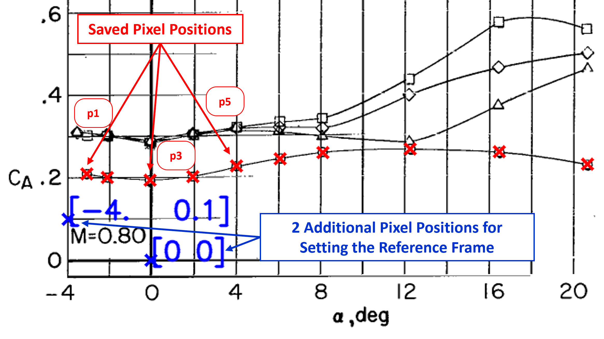
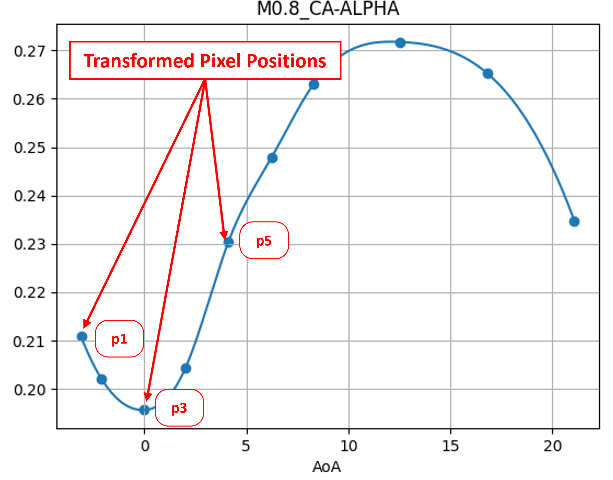

# Helper Functions - <a href="https://www.example.com/my great page">OpenFOAM-ToolChain-for-Rocket-Aerodynamic-Analysis</a>
__by Félix Marti Valverde__

This repository is part of a greater project found in the main repository _OpenFOAM ToolChain for Rocket Aerodynamic Analysis_ (https://github.com/WyllDuck/OpenFOAM-ToolChain-for-Rocket-Aerodynamic-Analysis). The functions contained here are miscellaneous calculations and or data extraction scripts to validate the CFD methodology followed in the main repository.

<p float="left">
  
  
</p>

### links

## SETUP

Install all the requiered python libraries 
```bash
python3 -m pip install -r requirements.txt
```

## CONTENT

### FOLDERS

<ul>
  <li><b>data</b>: <i>PDFs</i> containing only the relevant wind-tunnel graphs used to validate the CFD results. Data comes from sources [1][2].</li>
  
  <li><b>graph</b>: All the pages contained in the pdf from <i>data</i> are converted to <i>JPEG</i> images in order to procced to data digitalization using python scripts.</li>
  
  <li><b>paper_plots</b>: This folder <b>only contains Python scripts used to generate the plots in the report</b>. Click on link above to access the report.</li>
  
  <li><b>paraview_states_plots</b>: This folder <b>contains the Paraview state files used to postprocess CFD results in the report</b> in addition to the raw images added in the report. Click on link above to access the report.</li>
  
  <li><b>points</b>: Contains a set of <b>TXT</b> with information to extract each image in <b>graphs</b> to valuable aerodynamic coefficients</li>

</ul>

### SCRIPTS

<ul>
  <li><b>picture2coefficients.py</b>: Uses spline lines to extrapolate the data from the <i>TXT</i> in <i>points</i> to cover all relevant angles of attack. Additionally, a folder named <i>check_images</i> is generated containing 2 images per graph. One overlaying the <i>TXT</i> information to the original image in <i>graphs</i> to check for user input mistakes, and another image with the generated spline data points.</li>  

  <li><b>get_boundary_conditions.py</b>: Calculates the different boundary conditions required for each Mach Number to keep a constant Reynolds number.</li>
  
  <li><b>atmosphere.py</b>: Model of the atmosphere used to calculate inlet conditions in the <i>get_boundary_conditions.py</i> script</li>
  
  <li><b>get_configuration_files.py</b>: Configurable script assesses the generation of large amounts of configuration files for each CFD simulation. For more information on the structure and the usage of these configuration files please visit the main repository: https://github.com/WyllDuck/OpenFOAM-ToolChain-for-Rocket-Aerodynamic-Analysis </li>
</ul>

### CSV FILES

<ul>
  <li><b>CA_coefficients.csv</b>: Axial Aerodynamic Coefficient vs. Angle of Attack and Mach Number</li>
  
  <li><b>CN_coefficients.csv</b>: Normal Aerodynamic Coefficient vs. Angle of Attack and Mach Number</li>
  
  <li><b>Cm_coefficients.csv</b>: Pitch Moment Aerodynamic Coefficient vs. Angle of Attack and Mach Number</li>
  
  <li><b>boundary_conditions.csv</b>: All relevant inlet boundary conditions for each Mach number</li>
  
</ul>

## SOURCES

[1] J. C. Ferris. Static Stability Investigation of a Single-stage Sounding Rocket at Mach Numbers from 0.60 to 1.20. Tech. rep. 19670020050. Report/Patent Number: NASA-TN-D-4013, Accession Number: 67N29379. VA, United States: NASA Langley Research Center Hampton, July 1967. URL: https://ntrs.nasa.gov/citations/19670020050.

[2] C. D. Babb and D. E. Fuller. Static Stability Investigation of a Sounding-rocket Vehicle at Mach Numbers from 1.50 to 4.63. Tech. rep. 19670020031. Report/Patent Number: NASA-TN-D-4014, Accession Number: 67N29360. VA, United States: NASA Langley Research Center Hampton, June 1967. URL: https://ntrs.nasa.gov/citations/19670020031
